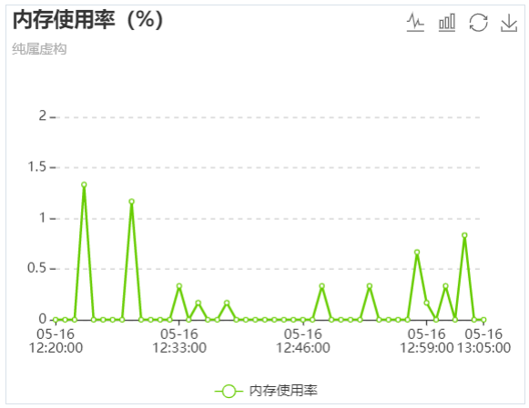
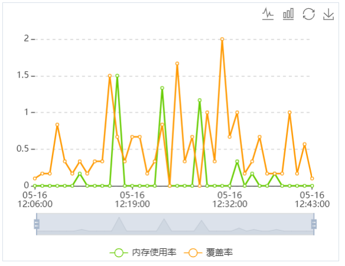
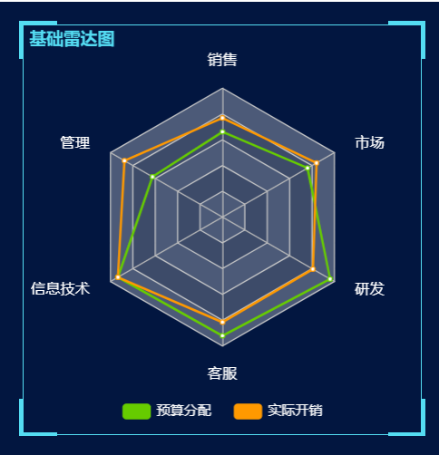
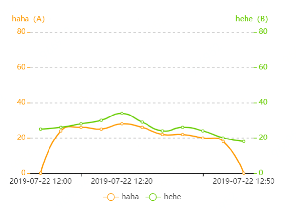
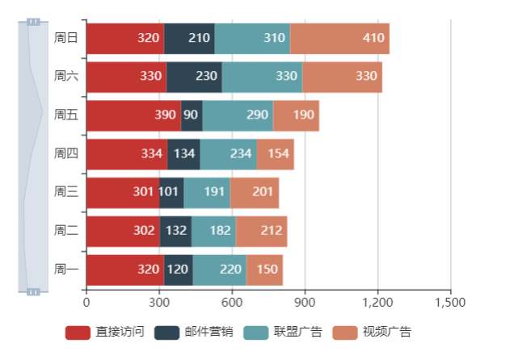
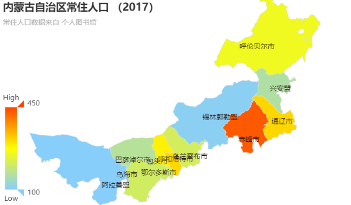

# backend

私有组件库搭建

### 在项目中安装方式

```
npm i vue_backend
```

### 在项目中使用方式

```js
import Vue from 'vue'
import Backend from 'vue_backend'

Vue.use(Backend)
```

直接使用组件

```html
<line-chart
  :seriesName="seriesName"
  :seriesData="seriesData"
  titleText="内存使用率（%）"
  v-if="showGraph"
  titleSubText="纯属虚构"
  :unit="unit"
>
</line-chart>
```

### 项目搭建

查看 CHANGELOG.md 文档 （包含以下内容）

### 项目变更记录

#### v-1.0.0(2019/06/28)

##### 新增 feature

-[项目搭建] 项目构建

-[新增 changeTime.vue 私有组件] 增加 demo

#### v-1.0.1(2019/07/03)

##### 新增 feature

-[项目搭建] 新增 storybook 的配置信息&源码

-[新增 line-chart.vue 私有组件] 增加 demo

#### v-1.0.7(2019/07/03)

##### 新增 feature

-[项目搭建] 新增 rolllup 配置文件可打包发布

-[新增 radar-chart.vue 私有组件] 增加 demo

-[打包发布到 npm]

#### v-1.1.1(2019/07/24)

##### 新增 feature

-[新增 smooth-line-chart.vue 私有组件] 增加 demo

-[新增 bar-chart.vue 私有组件] 增加 demo

#### v-1.1.2(2019/07/24)

##### 新增 feature

-[新增 geo-map.vue 私有组件] 增加 demo

### 私有组件实例

#### 单条折线图

```html
<line-chart
  :seriesName="seriesName"
  :seriesData="seriesData"
  titleText="内存使用率（%）"
  v-if="showGraph"
  titleSubText="纯属虚构"
  :unit="unit"
></line-chart>
```



#### 多条折线图



#### 大屏雷达图

```html
<radar-chart
  :title="title"
  :legendName="legendName"
  :indicator="indicator"
  :seriesData="seriesData"
></radar-chart>
```



#### 平滑折线图

```html
<smooth-line-chart
  :yAxisCfg="yAxisCfg"
  :legendData="legendData"
  :seriesData="seriesData"
  :unit="unit"
></smooth-line-chart>
```



#### 柱状图

```html
<bar-chart :yAxisData="yAxisData" :seriesData="seriesData"></bar-chart>
```



#### 地图

```html
<geo-map width="46%"></geo-map>
```


